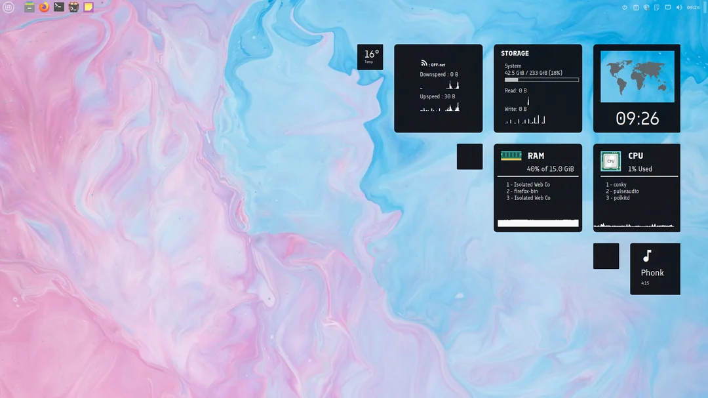
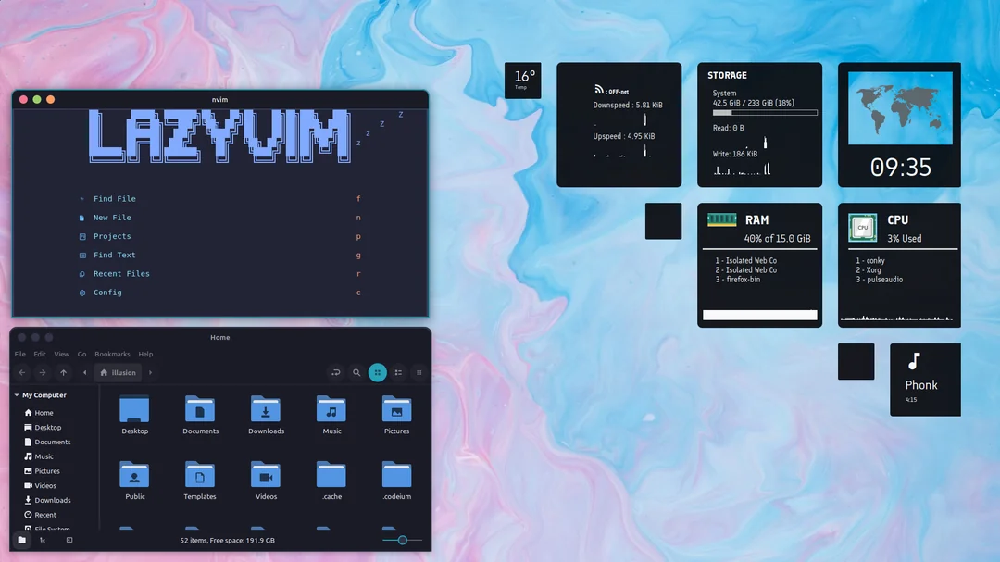
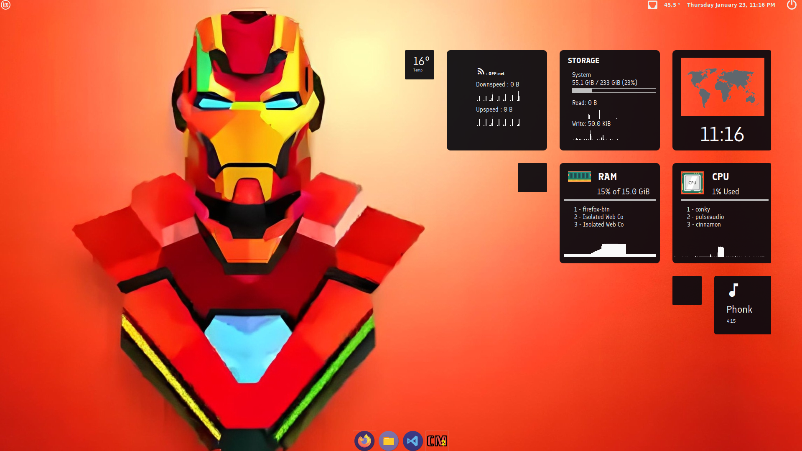

# Conky Customization - Sirius Theme

A customized build of Conky on top of the **Sirius Theme**. This guide includes steps for installing Conky Manager 2, importing themes, and applying the Sirius theme customization.

## Installation Guide

### Step 1: Install Conky Manager 2
To manage and apply Conky themes, you need to install Conky Manager 2. Use the following commands:

```bash
sudo add-apt-repository ppa:ubuntuhandbook1/conkymanager2
sudo apt update
sudo apt install conky-manager2
```

For more details, visit the [Ubuntu Handbook guide](https://ubuntuhandbook.org/index.php/2020/07/install-conky-manager-ubuntu-20-04-lts/).

### Step 2: Download the Sirius Theme
Download the **Sirius Theme** from [Closebox73’s Gnome Look page](https://www.gnome-look.org/p/1854716). The theme is provided as a zip file.

Alternatively, you can download the **customized version** of the Sirius Theme provided by [Prathamesh Jakkula](#):

[Download Customized Sirius Theme](Sirius.zip)

### Step 3: Import the Sirius Theme
1. Open **Conky Manager 2**.
2. Click on the **Import Theme Pack** option.
3. Select the downloaded Sirius Theme zip file.
4. The theme will be imported and available in the Conky Manager.

### Step 4: Apply the Theme
1. Open **Conky Manager 2**.
2. From the list of available themes, select the **Sirius Theme**.
3. Customize or enable the widgets as per your preference.

## Author and Credits
- **Customization**: [Prathamesh Jakkula](#).
- **Original Theme Creator**: [Closebox73](https://www.gnome-look.org/p/1854716).

## Preview
Here is a preview of the customized Sirius theme:





## Notes
- Ensure Conky is installed on your system. Conky Manager 2 requires Conky to function properly.
- This customization was tested on **Linux Mint OS**.
- Feel free to tweak the configurations to suit your setup!

---